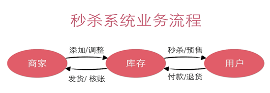
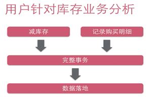

## 初始秒杀设计
### 业务分析

秒杀系统业务流程如下：

由图可知，整个系统是针对库存的。一个用户成功秒杀商品的话，对于系统来说就是两个操作：1.减库存；2.记录用户的购买明细。

记录用户的秒杀成功信息，需要记录：1.谁秒杀成功。2.购买成功的时间/有效期 。这些数据组成了用户的秒杀成功信息，也就是用户的购买行为。 

### 难点分析

1. ###### 高并发大流量对应用、数据库造成的高负载

秒杀活动的特点就是在短时间内有极高的并发访问量。

用户在秒杀开始前，不断刷新页面以保证不会错过秒杀。若果按照一般的项目结构，把这些流量直接穿透至数据库，那么会导致数据库极大的负担，甚至会导致网站的瘫痪。

2. ###### 超卖问题

 由于库存并发更新的问题，导致在实际库存已经不足的情况下，库存依然在减，导致卖家的商品卖得件数超过秒杀的预期 。

### 项目实现

​	本项目以学习为出发点，主要实现秒杀系统中的关键模块。

#### 登录模块

